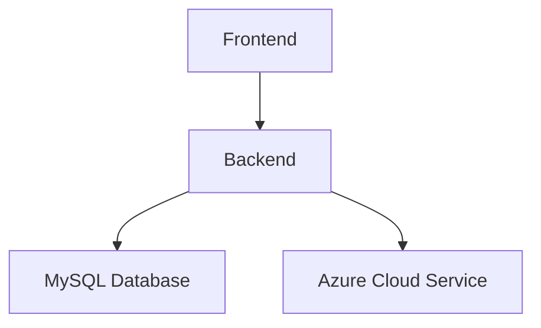

# Arquitetura da Aplicação

A arquitetura da aplicação será composta por três partes principais:

## Frontend
O frontend será desenvolvido em React e será responsável por toda a interação com o usuário. Ele irá conter as telas de login, tela inicial (home) e demais partes do software.

## Backend
O backend será desenvolvido em Node.js e será responsável por receber as requisições do frontend e processá-las. Ele irá conter os endpoints que irão tratar as requisições e enviar as respostas adequadas para o frontend.

## Banco de Dados
O banco de dados será um banco relacional MySQL. Ele será conectado ao backend da aplicação utilizando o Sequelize como ORM para manipulação dos dados. Serão criadas e operadas as requisições de GET, POST, PUT e DELETE no banco.

## Observação:
O backend será implementado como uma API REST, que receberá as requisições e fornecerá as respostas utilizando os métodos HTTP. A aplicação será hospedada na nuvem do Azure, juntamente com o banco de dados, como um serviço do Azure.

