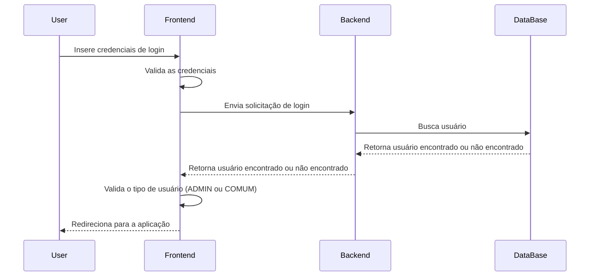

## Diagrama Geral da Aplicação

Neste diagrama será mostrado o funcionamento geral da aplicação, de forma que mostre os participantes e as suas integrações do sistema geral. 

    User->>Frontend: Navegação entre as páginas
    Frontend->>Frontend: Valida o tipo de usuário em cada navegação
    Frontend->>Backend: Envia solicitações HTTP/HTTPS (GET, POST, PUT, DELETE)
    Backend->>Backend: Executa operações por tipo de usuário
    Backend->>DataBase: Realiza buscas
    DataBase-->>Backend: Retorna resultado das operações
    Backend-->>Frontend: Retorna resultado das operações
    Frontend-->>User: Exibe mensagem de sucesso ou erro