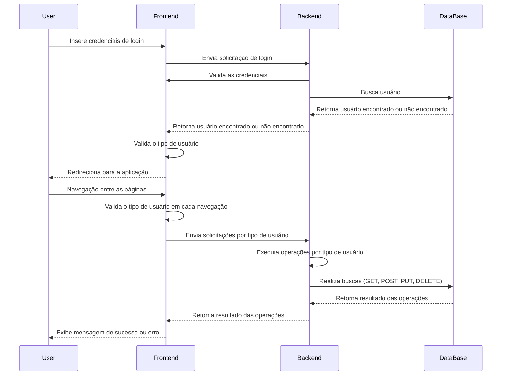

## Diagrama Geral da Aplicação

Neste diagrama será mostrado o funcionamento geral da aplicação, de forma que mostre os participantes e as suas integrações do sistema geral. 

```mermaid
sequenceDiagram
    participant User
    participant Frontend
    participant Backend
    participant DataBase

    User->>Frontend: Insere credenciais de login
    Frontend->>Backend: Envia solicitação de login
    Backend->>Frontend: Valida as credenciais
    Backend->>DataBase: Busca usuário
    DataBase-->>Backend: Retorna usuário encontrado ou não encontrado
    Backend-->>Frontend: Retorna usuário encontrado ou não encontrado
    Frontend->>Frontend: Valida o tipo de usuário
    Frontend-->>User: Redireciona para a aplicação
    User->>Frontend: Navegação entre as páginas
    Frontend->>Frontend: Valida o tipo de usuário em cada navegação
    Frontend->>Backend: Envia solicitações por tipo de usuário
    Backend->>Backend: Executa operações por tipo de usuário
    Backend->>DataBase: Realiza buscas (GET, POST, PUT, DELETE)
    DataBase-->>Backend: Retorna resultado das operações
    Backend-->>Frontend: Retorna resultado das operações
    Frontend-->>User: Exibe mensagem de sucesso ou erro
```